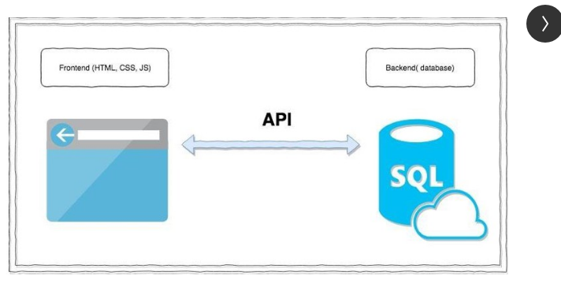

## API Interview Questions

### 1. Difference between API and Webservices?

API is a code used locally to perform specific action like API POI to interact with Excels.
Whereas if an API is used over the network for interaction between 2 components then it's called as web services. For ex You send a request through UI application to get a product detail which is saved in Database. For this a request mostly an HTTP request is sent from UI application to a Webservice hosted on some pysical or cloud server. The webservice(mostly Java) will then take the HTTP request, which includes request details in payload(JSON/XML format), create a query from this request and then query database and return you the details.

### 2. What is messaging in Restful WebServices?
The technique of sending a message from the client to the back end server in the form of an HTTP request and the server responding back with the response as HTTP Response is called Messaging. 

### 3. What is statelessness in Rest?
The REST architecture is designed in such a way that the client state is not maintained on the server. This is known as statelessness. 
The context is provided by the client to the server using which the server processes the client’s request.

### 4. RESTful webservices features?
1. The service is based on the Client-Server model.
2. The service uses HTTP Protocol for fetching data/resources, query execution, or any other functions.
3. It follows the statelessness concept where the client request and response are not dependent on others.

### 5. What is REST Resource?
Every content in the REST architecture is considered as Resource. These can be either text files, jsons.
The REST server provides access to these resources whereas REST client consumes these resources.

### 6. Object Mapped class in Jackson?

The Jackson ObjectMapper class (com.fasterxml.jackson.databind.ObjectMapper) is the simplest way to parse JSON with Jackson in Java.
1. Parsing JSON into Java objects is also referred to as to deserialize Java objects from JSON 
2. Generating JSON from Java objects is also referred to as to serialize Java objects into JSON - Restassured does it automatically.

```java
public class Employee {
private String name = null;
private int age = 0;

    public String getName() { return this.name; }
    public void setName(String name){ this.name = name;}

    public int  getAge() { return this.age; }
    public void seAge (int age) { this.age = age; }
}

ObjectMapper objectMapper = new ObjectMapper();

String employeeJson =
        "{ \"name\" : \"Adi\", \"age\" : 38 }";

try {
Employee emp = objectMapper.readValue(employeeJson, Employee.class);

    System.out.println("Employee name = " + emp.getName());
        System.out.println("Employee age = " + emp.getAge());
        } catch (IOException e) {
        e.printStackTrace();
}
```

To read Java objects from JSON with Jackson properly, it is important to know how Jackson maps the fields of a JSON object to the fields of a Java object, so I will explain how Jackson does that.
Jackson ObjectMapper
Jackson Databind
Jackson ObjectMapper Example
How Jackson ObjectMapper Matches JSON Fields to Java Fields
Jackson Annotations
Read Object From JSON String
Read Object From JSON Reader
Read Object From JSON File
Read Object From JSON via URL
Read Object From JSON InputStream
Read Object From JSON Byte Array
Read Object Array From JSON Array String
Read Object List From JSON Array String
Read Map from JSON String
Ignore Unknown JSON Fields
Fail on Null JSON Values for Primitive Types
Custom Deserializer
Write JSON From Objects
Custom Serializer
Jackson Date Formats
Date to long
Date to String
Jackson JSON Tree Model
Jackson Tree Model Example
The Jackson JsonNode Class
Convert Object to JsonNode
Convert JsonNode to Object
Reading and Writing Other Data Formats With the Jackson ObjectMapper
Reading and Writing CBOR With the Jackson ObjectMapper
Reading and Writing MessagePack With the Jackson ObjectMapper
Reading and Writing YAML With the Jackson ObjectMapper
Jakob Jenkov
Jakob Jenkov
Last update: 2024-02-01

Follow on Twitter Connect on LinkedIn Subscribe on YouTube Subscribe to RSS Feed Subscribe to Telegram Channel
The Jackson ObjectMapper class (com.fasterxml.jackson.databind.ObjectMapper) is the simplest way to parse JSON with Jackson in Java. The Jackson ObjectMapper can parse JSON from a string, stream or file, and create a Java object or object graph representing the parsed JSON. Parsing JSON into Java objects is also referred to as to deserialize Java objects from JSON.

The Jackson ObjectMapper can also create JSON from Java objects. Generating JSON from Java objects is also referred to as to serialize Java objects into JSON.

The Jackson Object mapper can parse JSON into objects of classes developed by you, or into objects of the built-in JSON tree model explained later in this tutorial.

By the way, the reason it is called ObjectMapper is because it maps JSON into Java Objects (deserialization), or Java Objects into JSON (serialization).

Jackson Databind
The ObjectMapper is located in the Jackson Databind project, so your application will need that project on its classpath to work. See the Jackson Installation tutorial for more information.

Jackson ObjectMapper Example
Here is a quick Java Jackson ObjectMapper example:

ObjectMapper objectMapper = new ObjectMapper();

String carJson =
"{ \"brand\" : \"Mercedes\", \"doors\" : 5 }";

try {
Car car = objectMapper.readValue(carJson, Car.class);

    System.out.println("car brand = " + car.getBrand());
    System.out.println("car doors = " + car.getDoors());
} catch (IOException e) {
e.printStackTrace();
}
The Car class was made by me. As you can see, the Car.class is parsed as the second parameter to the readValue() method. The first parameter of readValue() is the source of the JSON (string, stream or file). Here is how the Car class looks:

public class Car {
private String brand = null;
private int doors = 0;

    public String getBrand() { return this.brand; }
    public void   setBrand(String brand){ this.brand = brand;}

    public int  getDoors() { return this.doors; }
    public void setDoors (int doors) { this.doors = doors; }
}
How Jackson ObjectMapper Matches JSON Fields to Java Fields
To read Java objects from JSON with Jackson properly, it is important to know how Jackson maps the fields of a JSON object to the fields of a Java object, so I will explain how Jackson does that.

By default, Jackson maps the fields of a JSON object to fields in a Java object by matching the names of the JSON field to the getter and setter methods in the Java object. 
Jackson removes the "get" and "set" part of the names of the getter and setter methods, and converts the first character of the remaining name to lowercase.

### 7. Query parameters and Path parameters?

1. Path variables are part of the URL itself and are enclosed in curly braces. 
```java
/employee/{email}
```

2. Query parameters are attached to the end of the url and are followed by question mark. Query parameters are used to filter the records.
```java
/employees?name=Aditya&state=Illinois
```

When dealing with a single specific item use path parameter, while use query parameters for filtering records.

### 8. What is difference in oAuth 1.0 and oAuth2.0 ?
OAuth 2.0 was introduced to address many of the pain points developers were facing with OAuth 1.0.

In the earlier OAuth 1.0 version, access tokens had a longer lifespan.
OAuth2.0 access tokens has expiry dates. They are short-lived, often lasting from several minutes to a few hours.

OAuth 1.0 primarily defined a single standardized flow, rather than multiple flows, for different types of apps (web, mobile, desktop). 
This flow worked great in theory, but in practice, it was limiting for apps that didn’t live on the browser.
OAuth 2.0 supports six authorization flows (known as grant types), each specialized for a different type of app. 

How does OAuth 2.0 works?

In OAuth 2.0, apps use access tokens to access protected data

1. Resources are protected data that require OAuth to access them.
2. Resource Owner: Owns the data in the resource server. An entity capable of granting access to protected data. For example, a user Google Drive account.
3. Resource Server: The API which stores the data. For example, Google Photos or Google Drive.
4. Client: It is a third-party application that wants to access your data, for example, a photo editor application.

### 9. API


### 10 What is REST API?
An API can be REST if it follows the below constraints-
1. Uniform Interface ->Both client and server has to communicate and agree to certain rules (like they should communicate with same resource xml, json).
2. APIs are stateless and client and server does not worry about state of request or response.

### 11. What is payload in API?
A payload refers to the actual data that is being transferred between the client and the server.

In the context of an API (Application Programming Interface), a payload refers to the data that is sent in a request or received in a response.
It is the essential content of the message being transmitted between a client (such as a web application or mobile app) and a server.

### 12. What are the types of status codes?
1xx-- Informational

2xx-- 
200  OK - Request has succeeded
201 created

4xx--
1. 400 Bad Request - Server could not understand the request due to incorrect syntax.
2. 401 unauthorized - the server was unable to identify the user because the client's authentication credentials were invalid or missing.
3. 403 Forbidden - The client does not have access rights to the content. 
4. 404 Not Found - The server can not find the requested resource.

5xx--
1. 500 Internal Server error -

### 13. 
